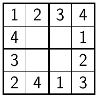
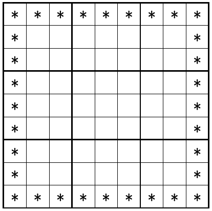

# Boundary Sudokus

For 4x4 Sudokus it is not difficult to find examples such that: *(1)* the hints are given by the entries on the boundary, and *(2)* the Sudoku has only one solution. One example is given below:

For this 4x4 Sudoku, all the 12 boundary entries are given as hints, and there is only one way to complete the missing four entries in the middle. This is also true in general. For any valid 4x4 Sudoku, the entire board is determined by the digits on the boundary. (This is true since each piece in the middle is part of a 2x2 block with only one missing piece.)

Motivated by the 4x4 case, we may ask if there are similar 9x9 Sudokus. In other words, is there any Sudoku board with the below hint pattern that has only one solution? 

Here all 32 boundary entries are filled in as hints (marked with *), and we ask if these can uniquely determine the remaining 7x7 = 49 digits in the middle. The code below does a search through all possible boundary configurations with the above pattern. This is a combination of symmetry and brute force. By applying suitable symmetries, the problem reduces to studying ≈400 million  configurations with the above pattern (see below). Each of these is solved using the JSolve.c Sudoku solver by Jason Linhart. Unfortunately, none of these have a unique solution. Thus, the code finds no 9x9 Sudoku of the above form that has only one solution. This is in line with the discussion and the example given in the subsection "Constraints of Clue Geometry" on the Wikipedia page [mathematics of Sudoku](https://en.wikipedia.org/wiki/Mathematics_of_Sudoku) (7/2015).

# Symmetry reduction

Sudokus with the above hint pattern have a number of natural symmetries. First, the digits can be relabelled. One can therefore assume that the top row has entries 123456789. One can also exchange columns (or rows) 2, 3, columns (rows) 3, 4, 5 and columns (rows) 7, 8. Lastly, Sudoku's have the symmetries of the square. For example, mirroring the Sudoku over the vertical axis gives another Sudoku. These symmetries makes the exhaustive search feasible.

The computation is divided into three steps. For instructions for running these, please see [running.md](running.md). On a ca. 2013 laptop (3GHz Intel i7, 8GB memory) the entire computation takes less than two hours. 

## Step 1 (Right border)

In the first step the code enumerates all possible top-right border configurations. This gives 52 configurations that (up to symmetry) represent all possible top-right borders. The symmetries for this reduction are: relabelling the digits, the row/column permutations described above, and mirroring over the "/"-diagonal.

See: [FindRightBorders.scala](./src/main/scala/FindRightBorders.scala)

## Step 2 (Bottom border)

In Step 2 the code enumerates all possible top-right-bottom border configurations. This is done similarly to the previous step and gives (after reduction) 147372 configurations. In the reduction step, mirroring over the "/"-diagonal is replaced by mirroring over the vertical axis.

See: [FindBottomRows.scala](./src/main/scala/FindBottomRows.scala)

## Step 3 (Left border)

Unlike Step 1 and 2, Step 3 does not rely on symmetry. Instead the last step loops over all 147372 configurations from Step 2, expands all possible left sides for each configuration, and checks if any of them is a Sudoku board with a unique solution. The actual solving is done using the JSolve.c solver, which is called for 397 million configurations. Of these, most (283 million) configurations are invalid and have zero solutions. For example, the generated list is not pruned and also includes configurations where the same digit appears twice on the same row. The remaining (114 million) configurations all have many solutions, and no board in the list has a unique solution.

See: [step3.py](./src-step3/step3.py)

## License

(c) Matias Dahl, 2015. This work is licensed under the MIT license. See the [LICENSE](./LICENSE.md) file.

Step 3 uses the JSolve Sudoku solver v. 1.2 written by Jason T. Linhart, 2010. The license for JSolve are given in its [source code](https://github.com/attractivechaos/plb/tree/master/sudoku/incoming). 

The above Sudoku board images were generated using the [sudoku.sty](https://www.ctan.org/tex-archive/macros/latex/contrib/sudoku?lang=en) Latex package and by adapting the example code from the following [stackexchange answer](http://tex.stackexchange.com/a/50058) by user egreg. 

