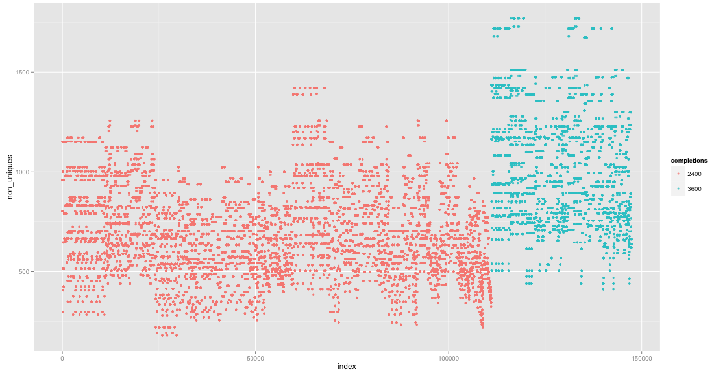

# Compiling and running

The below instructions have been tested with Scala 2.11.6, sbt 0.13.7 and Python 2.7.5
on Mac OS X.

#### Compiling and testing the Scala code for Steps 1 and 2

```
sbt clean
sbt compile
sbt test  
```

#### Compiling and testing for Step 3

The below compiles the python bindings for the JSolve.c solver: 

```
cd src-step3

# Download JSolve 1.2 sources
wget https://raw.githubusercontent.com/attractivechaos/plb/master/sudoku/incoming/JSolve.c
wget https://raw.githubusercontent.com/attractivechaos/plb/master/sudoku/incoming/JSolve.h

# compile python bindings for JSolve
python setup.py build_ext --inplace

python run-tests.py

cd ..
```

#### Run search

After the above steps, the command:

```
./run-script
```

will run all steps (steps 1, 2, 3) for the search. 

### Output from Step 2

Step 2 will produce a text file `top-right-bottom-reduced.txt` with 147372 lines. The first few lines read:

```
123456789........1........2........4........7........8........3........5497513826
123456789........1........2........4........5........7........6........8298675413
123456789........1........4........2........7........8........3........5539728416
123456789........2........4........5........7........8........1........6967125843
123456789........1........4........2........5........7........3........8835179246
```

Each line represents a Sudoku board where the top, right and bottom borders are filled in. Moreover, these represent all possible boundary Sudokus: any Sodoku with hints only on the boundary can be transformed (by symmetry) so that its top-right-bottom borders match one of the 147372 entries in this file. The symmetries for this are described in the [README](README.md) file.

### Output from Step 3

The output of Step 3 is the text file `solutions.txt`. 

```
123456789........1........2........4........7........8........3........5497513826, 0, 632, 2400
123456789........1........2........4........5........7........6........8298675413, 0, 1042, 3600
123456789........1........4........2........7........8........3........5539728416, 0, 582, 2400
123456789........2........4........5........7........8........1........6967125843, 0, 742, 2400
123456789........1........4........2........5........7........3........8835179246, 0, 560, 2400
```

It is identical to the above file from Step 2, but contains three additional columns. For each line, the second column describes the number of completions for the left border that give only one solution. (In Step 2, the entries on the left border are unassigned. Or more precisely, the top, right and bottom borders are assigned, but the mid-7 entries on the left border are unassigned). The third column describes the number of completions that give more than one solution. The last column is a technical variable. It is the number of completions for the left side that are compatible with the top row, and with the first entry on the bottom row. 

The second column is zero for all lines. This indicates that there are no boundary Sudokus with a unique solution.  The last column contains only two values: 2400 and 3600.

It can be instructive to visualize the data in the output file. The below plot shows the number of non-unique completions per board. Here, the 147372 boards (on the vertical axis) have been ordered: First, according to the last column (with values 2400 and 3600), and second, by lexicographically ordering the boards (as strings). This does seem to show some kind of patterns. 


